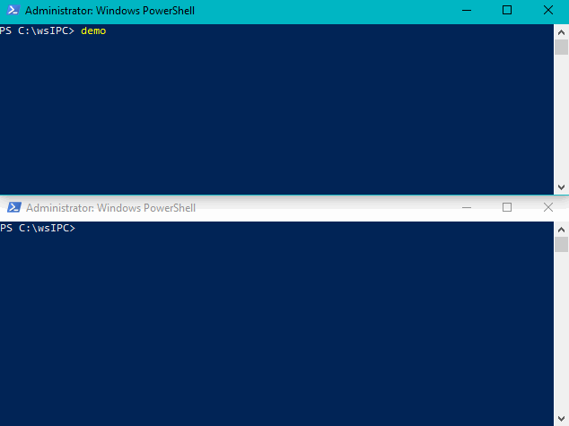

# wsIPC

wsIPC is a Proof-of-Concept for Windows that abuses shared RO pages in the process Working Set (page cache) to build a simple covert inter-process communication channel.

## Background

[Page Cache Attacks](https://arxiv.org/pdf/1901.01161.pdf) is a recently published paper by Gruss et al. which describes a page-resolution side-channel due to process-level page caching on OSes such as Linux and Windows. 
Full details are in the paper.

## PoC

This VS2017 solution consists of a wsIPC dynamically-linked library which implements the side channel-based communications and some demo template code to show how it's used.
To run, simply start one instance of Demo.exe as the sender:

    PS C:\wsIPC> .\Demo.exe send
                 _______  _____
     _    _____ /  _/ _ \/ ___/
    | |/|/ (_-<_/ // ___/ /__
    |__,__/___/___/_/   \___/
     POC by @depletionmode
    [+] wsIpc library loaded successfully @ 0x0FDE0000.
    [-] Attempting to send message (ArthurMorgan[13])...
    [+] ...successfully sent!

And a further instance as the receiver:

    PS C:\wsIPC> .\Demo.exe recv
                 _______  _____
     _    _____ /  _/ _ \/ ___/
    | |/|/ (_-<_/ // ___/ /__
    |__,__/___/___/_/   \___/
     POC by @depletionmode
     [+] wsIpc library loaded successfully @ 0x0FDE0000.
     [-] Attempting to read message...
     [+] ...successfully received! -> ArthurMorgan

*NOTE:* Windows 10 19H1 contains a mitigation for the side-channel (the Working Set ShareCount is sanitized for non-privileged processes). On 19H1+, the PoC must therefore be run elevated.

## Library usage

wsIPC.dll can be dynamically loaded by any process. Usage is as simple as Send()-ing from one process and Receive()-ing from another.

    typedef HRESULT(*IpcSend)(PBYTE, ULONG);
    typedef HRESULT(*IpcReceive)(BYTE*, SIZE_T, SIZE_T*);

    HMODULE lib = LoadLibraryA("wsIPC.dll");

    IpcSend pIpcSend = (IpcSend)GetProcAddress(lib, "Send");
    IpcReceive pIpcReceive = (IpcReceive)GetProcAddress(lib, "Receive");
